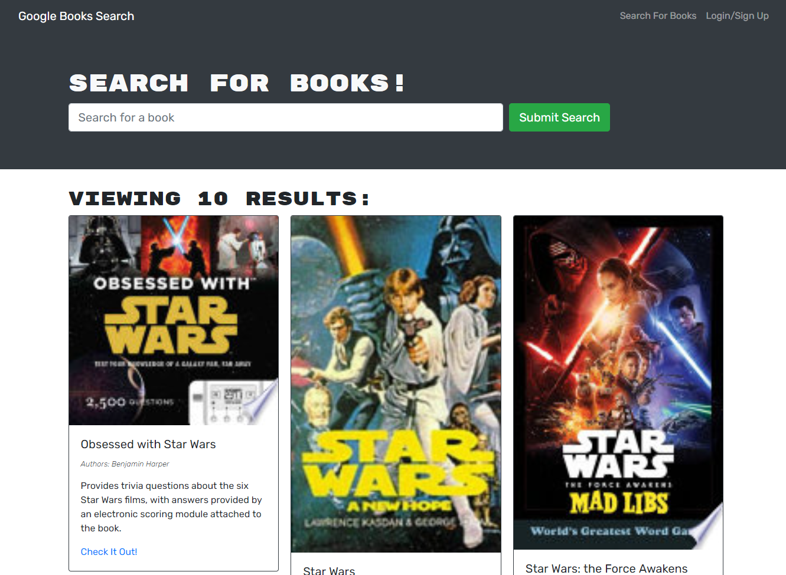

# who-needs-a-librarian

## Description

This is a React app that uses GraphQL on the back-end, along with Apollo Server and MongoDB via Mongoose. It also uses Google's Book API to fetch books, which a user can save to a book list on their account. Each fetched book has a title, authors, description, image, and a link to the book on Google. User accounts require a valid email address, username, and password. JWT are used to keep track of logged-in users and whether they need to log in again before proceeding to other site functionalities.

A live version of the app can be found on [Heroku](https://who-needs-a-librarian.herokuapp.com/).

## Table of Contents

- [Installation](#installation)
- [Usage](#usage)
- [Contributing](#contributing)
- [Questions](#questions)

## Installation

To install, simply clone the repo and packages.

## Usage

Launch from local with full functionality by using "npm i" for packages, followed by "npm run develop" to get it running in the browser.

## Contributing

The project is not accepting any contributions at this time.

## Questions

If you have any questions, feel free to contact me. Thanks!

Email: hulse.spencer@gmail.com

GitHub: [SpencerHulse](https://github.com/SpencerHulse)
